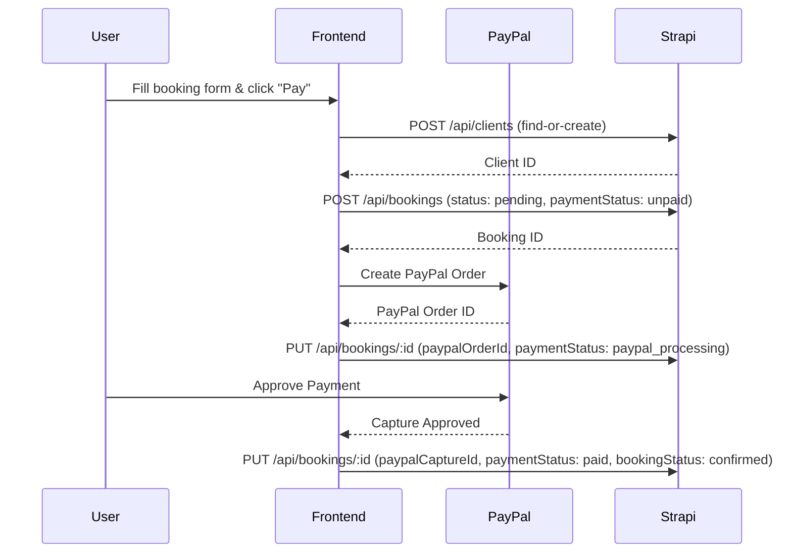

# Booking & Client API Contract — Strapi v5 REST API

> **Backend**: Strapi v5 Cloud at `https://phenomenal-growth-682e298e29.strapiapp.com`
> **Auth**: All write endpoints require an API Token (Bearer) with Content-Type create/update permissions for `Booking` and `Client`.

---

## Overview — Payment Flow



---

## 1. Client

### Schema

| Field | Type | Required | Unique | Notes |
|-------|------|----------|--------|-------|
| `firstName` | `string` | ✅ | | |
| `lastName` | `string` | ✅ | | |
| `email` | `email` | ✅ | ✅ | Used for find-or-create |
| `phoneNumber` | `string` | | | |
| `bookings` | `relation` | | | `oneToMany` → `Booking` (read-only, inverse side) |

### Endpoints

#### Find client by email
```
GET /api/clients?filters[email][$eq]=john@example.com
Authorization: Bearer <API_TOKEN>
```

**Response** (`200 OK`):
```json
{
  "data": [
    {
      "id": 1,
      "documentId": "abc123xyz",
      "firstName": "John",
      "lastName": "Doe",
      "email": "john@example.com",
      "phoneNumber": "+230 123 4567"
    }
  ],
  "meta": { "pagination": { "page": 1, "pageSize": 25, "pageCount": 1, "total": 1 } }
}
```

#### Create a new client
```
POST /api/clients
Authorization: Bearer <API_TOKEN>
Content-Type: application/json
```
```json
{
  "data": {
    "firstName": "John",
    "lastName": "Doe",
    "email": "john@example.com",
    "phoneNumber": "+230 123 4567"
  }
}
```

**Response** (`201 Created`):
```json
{
  "data": {
    "id": 1,
    "documentId": "abc123xyz",
    "firstName": "John",
    "lastName": "Doe",
    "email": "john@example.com",
    "phoneNumber": "+230 123 4567"
  }
}
```

> [!NOTE]
> Draft & Publish is **disabled** on Client. Entries are live immediately upon creation.

---

## 2. Booking

### Schema

| Field | Type | Required | Default | Enum Values |
|-------|------|----------|---------|-------------|
| `bookingType` | `enumeration` | ✅ | `"activity"` | `car_rental`, `activity`, `accommodation` |
| `startDate` | `datetime` | ✅ | | ISO 8601 format |
| `endDate` | `datetime` | | | ISO 8601 format |
| `participants` | `integer` | ✅ | | min: `1` |
| `bookingStatus` | `enumeration` | ✅ | `"pending"` | `pending`, `confirmed`, `cancelled`, `completed` |
| `totalPrice` | `decimal` | ✅ | | |
| `paymentStatus` | `enumeration` | | | `unpaid`, `paypal_processing`, `paid`, `refunded`, `failed` |
| `paypalOrderId` | `string` | | | PayPal Order ID |
| `paypalCaptureId` | `string` | | | PayPal Capture ID |
| `client` | `relation` | | | `manyToOne` → `Client` (use `documentId`) |
| `activity` | `relation` | | | `manyToOne` → `Activity` (use `documentId`, **private** field) |

### Endpoints

#### Create a booking (Step 1 — before payment)
```
POST /api/bookings
Authorization: Bearer <API_TOKEN>
Content-Type: application/json
```
```json
{
  "data": {
    "bookingType": "activity",
    "startDate": "2026-04-15T09:00:00.000Z",
    "endDate": "2026-04-15T12:00:00.000Z",
    "participants": 2,
    "bookingStatus": "pending",
    "totalPrice": 150.00,
    "paymentStatus": "unpaid",
    "client": "abc123xyz",
    "activity": "def456uvw"
  }
}
```

> [!NOTE]
> **Relations in Strapi v5** use `documentId` (a string), not the numeric `id`. Pass the `documentId` of the Client and Activity directly as a string value.

**Response** (`201 Created`):
```json
{
  "data": {
    "id": 5,
    "documentId": "booking789",
    "bookingType": "activity",
    "startDate": "2026-04-15T09:00:00.000Z",
    "endDate": "2026-04-15T12:00:00.000Z",
    "participants": 2,
    "bookingStatus": "pending",
    "totalPrice": 150.00,
    "paymentStatus": "unpaid",
    "paypalOrderId": null,
    "paypalCaptureId": null
  }
}
```

#### Update booking with PayPal info (Step 2 — after PayPal order creation)
```
PUT /api/bookings/:documentId
Authorization: Bearer <API_TOKEN>
Content-Type: application/json
```
```json
{
  "data": {
    "paypalOrderId": "PAYPAL-ORDER-5XJ123",
    "paymentStatus": "paypal_processing"
  }
}
```

#### Confirm booking after payment (Step 3 — after PayPal capture)
```
PUT /api/bookings/:documentId
Authorization: Bearer <API_TOKEN>
Content-Type: application/json
```
```json
{
  "data": {
    "paypalCaptureId": "CAPTURE-9AB456",
    "paymentStatus": "paid",
    "bookingStatus": "confirmed"
  }
}
```

> [!NOTE]
> Draft & Publish is **disabled** on Booking. Entries are live immediately upon creation.

#### Get a booking with relations populated
```
GET /api/bookings/:documentId?populate[client]=true&populate[activity]=true
Authorization: Bearer <API_TOKEN>
```

---

## 3. Activity (Read-Only Reference)

These are the pricing-relevant fields on `Activity` that the frontend needs when calculating `totalPrice`:

| Field | Type | Notes |
|-------|------|-------|
| `adultPrice` | `decimal` | Per-adult price (or group price if `isGroupPrice` is true) |
| `childPrice` | `decimal` | Per-child price |
| `isGroupPrice` | `boolean` | If `true`, `adultPrice` is for the entire group, not per person |
| `maxPersons` | `integer` | Maximum participants allowed |
| `documentId` | `string` | **Use this** when linking to a booking, not the numeric `id` |

#### Fetch activity pricing
```
GET /api/activities/:documentId?fields[0]=adultPrice&fields[1]=childPrice&fields[2]=isGroupPrice&fields[3]=maxPersons
```

---

## 4. Recommended Frontend Implementation

### Find-or-Create Client Helper
```typescript
async function findOrCreateClient(clientData: {
  firstName: string;
  lastName: string;
  email: string;
  phoneNumber?: string;
}): Promise<string> {
  // 1. Search for existing client by email
  const searchRes = await fetch(
    `${STRAPI_URL}/api/clients?filters[email][$eq]=${encodeURIComponent(clientData.email)}`,
    { headers: { Authorization: `Bearer ${API_TOKEN}` } }
  );
  const searchJson = await searchRes.json();

  if (searchJson.data.length > 0) {
    return searchJson.data[0].documentId;
  }

  // 2. Create new client
  const createRes = await fetch(`${STRAPI_URL}/api/clients`, {
    method: 'POST',
    headers: {
      Authorization: `Bearer ${API_TOKEN}`,
      'Content-Type': 'application/json',
    },
    body: JSON.stringify({ data: clientData }),
  });
  const createJson = await createRes.json();
  return createJson.data.documentId;
}
```

### Create Booking Helper
```typescript
async function createBooking(bookingData: {
  bookingType: 'car_rental' | 'activity' | 'accommodation';
  startDate: string;   // ISO 8601
  endDate?: string;     // ISO 8601
  participants: number;
  totalPrice: number;
  clientDocumentId: string;
  activityDocumentId: string;
}): Promise<string> {
  const res = await fetch(`${STRAPI_URL}/api/bookings`, {
    method: 'POST',
    headers: {
      Authorization: `Bearer ${API_TOKEN}`,
      'Content-Type': 'application/json',
    },
    body: JSON.stringify({
      data: {
        bookingType: bookingData.bookingType,
        startDate: bookingData.startDate,
        endDate: bookingData.endDate,
        participants: bookingData.participants,
        bookingStatus: 'pending',
        totalPrice: bookingData.totalPrice,
        paymentStatus: 'unpaid',
        client: bookingData.clientDocumentId,
        activity: bookingData.activityDocumentId,
      },
    }),
  });
  const json = await res.json();
  return json.data.documentId;
}
```

---

## 5. Error Handling

| HTTP Status | Meaning | Common Cause |
|-------------|---------|--------------|
| `400` | Validation Error | Missing required field, invalid enum value, `participants < 1` |
| `401` | Unauthorized | Missing or invalid API Token |
| `403` | Forbidden | Token lacks permissions for this content type |
| `404` | Not Found | Invalid `documentId` in URL |
| `409` | Conflict | Duplicate `email` when creating Client |

Error response shape:
```json
{
  "data": null,
  "error": {
    "status": 400,
    "name": "ValidationError",
    "message": "Missing \"data.participants\" attribute",
    "details": {}
  }
}
```
